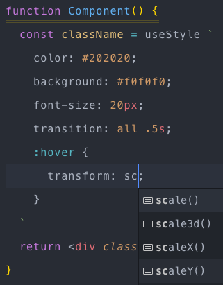

# style-hook vsocde extension

Syntax highlighting and IntelliSense for [style-hook](https://github.com/style-hook/style-hook).

Uses a CSS grammar built on top of [language-sass](https://github.com/atom/language-sass) and [language-css](https://github.com/atom/language-css).


[[Github Source](https://github.com/style-hook/vscode-style-hook)]

## preview


## Install

Inside VSCode, press `shift + ctrl + x` (mac: `⇧⌘ + X`), and enter:
```
style-hook
```
or, press `ctrl + p` (mac: `⌘ + P`), and enter:
```
ext install style-hook
```

It should be the top result.

## Features

- Syntax highlighting for styled components in JavaScript and TypeScript.
- Detailed CSS IntelliSense while working in styled strings.
- Syntax error reporting.

## Usage

The styled-components extension adds highlighting and IntelliSense for styled-component template strings in JavaScript and TypeScript. See [plugin configuration](https://github.com/style-hook/typescript-style-hook-plugin#configuration) for information on configuring the linter and other language features.

## knowledge
original forked from: https://github.com/styled-components/vscode-styled-components
